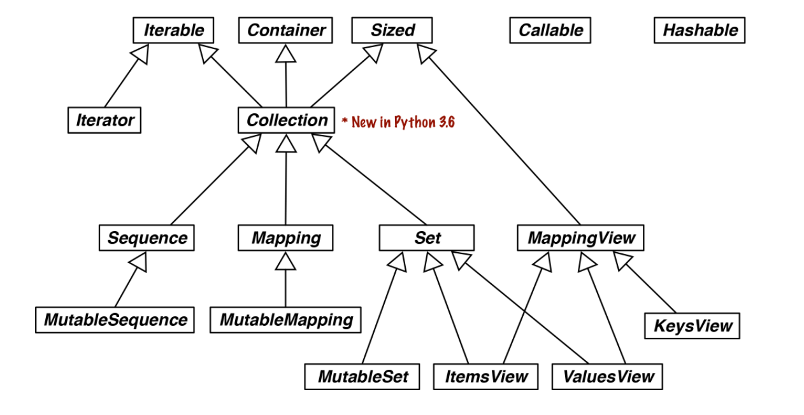
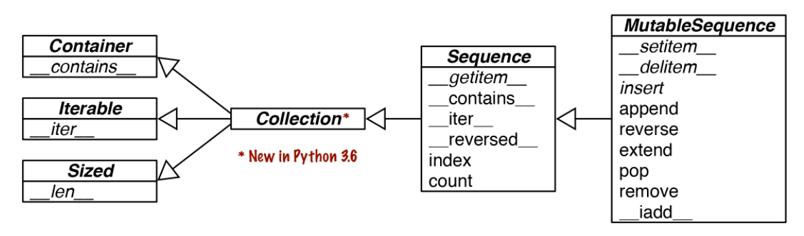

- [Comprenhension](#comprenhension)
- [Generadores](#gen)
- [Colas](#colas)
- [Pattern Matching](#patron)
- [Copia de objetos. Shallow y Deep Copy](#copia)
- [Diccionarios](#dicc)
- [Sets](#set)
- [Crear clases](#clases)
- [Programacion funcional](#func)
- [Tipificación de objetos](#hint)
- [Decoradores](#dec)
- [Caso práctico de Modelado de Objetos](#modelado)
- [Clases Abstractas](#ABC)
- [Protocolos](#protocol)
- [Iterables](#iterable)
- [Context Managers](#ctx_manager)
- [Corutinas](#corutina)

# Varios

## <a name="comprenhension">Comprehension</a>

Son equivalentes:

```py
beyond_ascii = [ord(s) for s in symbols if ord(s) > 127]

beyond_ascii = list(filter(lambda c: c > 127, map(ord, symbols)))
```

Producto cartesiano:

```py
tshirts = [(color, size) for color in colors for size in sizes]
```

## <a name="gen">Generator</a>

```py
tshirts = (color for color in colors)

tuple(ord(symbol) for symbol in symbols)
```

## <a name="colas">Colas</a>

```py
from collections import deque

dq = deque(range(10), maxlen=10)  

dq.rotate(3)  
dq.rotate(-4)

dq.append(val)
dq.appendleft(val)  

dq.extend([val1, val2, val3])  
dq.extendleft([val1, val2, val3])  

dq.insert(pos, val)

dq.remove(val)

dq.pop()
dq.popleft()

dq.index(val)

dq.clear()

dq.copy()

dq.count()

dq.reverse()

dq.sort([key], [reverse])
```

Otros paquetes:
- queue
- multiprocessing
- asyncio

### queue

```py
from collections import queue
```

This provides the synchronized (i.e., thread-safe) classes SimpleQueue, Queue, LifoQueue, and PriorityQueue. These can be used for safe communication between threads. All except SimpleQueue can be bounded by providing a maxsize argument greater than 0 to the constructor. However, they don’t discard items to make room as deque does. Instead, when the queue is full the insertion of a new item blocks—i.e., it waits until some other thread makes room by taking an item from the queue, which is useful to throttle the number of live threads

### multiprocessing

```py
from collections import multiprocessing
```

Implements its own unbounded SimpleQueue and bounded Queue, very similar to those in the queue package, but designed for interprocess communication. A specialized multiprocessing.JoinableQueue is provided for task management

### asyncio

```py
from collections import asyncio
```

Provides Queue, LifoQueue, PriorityQueue, and JoinableQueue with APIs inspired by the classes in the queue and multiprocessing modules, but adapted for managing tasks in asynchronous programming

## <a name="patron">Pattern Matching</a>

```py
def get_creators(record: dict) -> list:
    match record:
        case {'type': 'book', 'api': 2, 'authors': [*names]}:  
            return names
        case {'type': 'book', 'api': 1, 'author': name}:  
            return [name]
        case {'type': 'book'}:  
            raise ValueError(f"Invalid 'book' record: {record!r}")
        case {'type': 'movie', 'director': name}:  
            return [name]
        case _:  
            raise ValueError(f'Invalid record: {record!r}')
```


## Contexto

Con el contexto tenemos acceso a varias propiedades, entre ellas al número de decimales a utilizar por defecto:

```py
import decimal
ctx = decimal.getcontext()  
ctx.prec = 40  
one_third = decimal.Decimal('1') / decimal.Decimal('3')  
one_third  
Decimal('0.3333333333333333333333333333333333333333')

ctx.prec = 28  

one_third == +one_third  
False
```

## <a name="copia">Copy</a>

Cuando igualamos una variable a otra, lo que estamos haciendo es establecer creando una referencia a la misma posición de memoria.

```py
charles = {'name': 'Charles L. Dodgson', 'born': 1832}
lewis = charles  

lewis is charles
True

id(charles), id(lewis)  
(4300473992, 4300473992)
```

Si creamos otro diccionario con los mismos valores, la referencia es diferente:

```py
alex = {'name': 'Charles L. Dodgson', 'born': 1832, 'balance': 950}  

alex == charles  
True

alex is not charles  
True
```

`is` compara los hashes de las dos variables, y estos son diferentes. `==` compara los valores tal y como se hayan definido en \_\_eq\_\_. `a==b` es equivalente a `a.__eq__(b)`.

Habitualmente nos interesará usar `==`, aunque hay una referencia muy utilizada, `None` que usaremos con `is`.

Para copiar una lista la forma más sencilla es hacer `copia=list(original)`. La copia es por defecto _swallow_. Esto significa que `copia` y `original` seran dos referencias diferentes, pero los valores serán los mismos. Esto, es si alguno de los elementos de la lista es mutable, cambiandolo a tráves de `original` estaremos afectando a `copia`.

```py
l1 = [3, [55, 44], (7, 8, 9)]
l2 = list(l1)  

l2 == l1  
True

l2 is l1  
False
```

Haciendo `l2 = l1[:]` conseguimos el mismo efecto.

Si tenemos:

```py
l1 = [3, [66, 55, 44], (7, 8, 9)]
l2 = list(l1)      
```

No se vera en l2, porque hemos añadido un elemento más a la primera referencia:

```py
l1.append(100)     
```

El elemento `[1]` es mutable, así que si lo modificamos la referencia que tenemos en `l1[1]` no cambia, y esta es la misma referencia que tenemos en `l2[1]`. Estos cambios son visibles pués tanto desde `l1` como desde `l2`: 

```py
l1[1].remove(55)   
l2[1] += [33, 22]
```
El elemento `l2[2]` esta apuntando a una tupla, que es inmutable. Esto significa que al hacer esta operación se está creando una nueva referencia para la tupla, es decir que `l2[2]` y `l1[2]` ya no apuntan al mismo sitio:

```py
l2[2] += (10, 11)  
```

### Shallow and Deep Copy

Si hacemos:

```py
class Bus:
    def __init__(self, passengers=None):
        if passengers is None:
            self.passengers = []
        else:
            self.passengers = list(passengers)

    def pick(self, name):
        self.passengers.append(name)

    def drop(self, name):
        self.passengers.remove(name)
```

tenemos una variable de instancia, `self.passengers` que es una lista. Si al constructor le alimentamos con una lista, se crea una copia de la misma, esto es, una shallow copy. 

```py
import copy
bus1 = Bus(['Alice', 'Bill', 'Claire', 'David'])
bus2 = copy.copy(bus1)
bus3 = copy.deepcopy(bus1)
```

`bus1`y `bus2` son `==` pero no tienen el mismo `id`. `self.passengers`, el contenido, tendran el mismo `id`:

```py
id(bus1), id(bus2), id(bus3)
(4301498296, 4301499416, 4301499752)
```

Si ahora hacemos:

```py
bus1.drop('Bill')
```

Se vera refleajado en `bus2` pero no en `bus3`. Podemos ver como efectivamente la propiedad `passengers` de `bus1` y `bus2` es la misma, pero no así en `bus3`: 

```py
id(bus1.passengers), id(bus2.passengers), id(bus3.passengers)
(4302658568, 4302658568, 4302657800)
```

### referencias

Los argumentos se pasan a las funciones siempre por referencia. Esto significa que cuando los argumentos se refieran a tipos mutables, una modificación del argumento será _visible_ fuera del método.


# <a name="dicc">Diccionario</a>

Métodos que hacen de un diccionario un diccionario:

```py
d.__contains__(k). Implementa `in`
d.__delitem__(k)
d.__getitem__(k). Implementa `[x]`
d.__iter__().
d.__len__()
d.__missing__(k). Este método es llamado cuando hacemos un `[x]` y el índice no existe
d.__reversed__()
d.__setitem__(k, v)
```

Ejemplo de creacion de un tipo de diccionario custom:

```py
class StrKeyDict0(dict):  
    def __missing__(self, key):
		if isinstance(key, str):  
            raise KeyError(key)
        return self[str(key)]  

    def get(self, key, default=None):
        try:
            return self[key]  
        except KeyError:
            return default  

    def __contains__(self, key):
        return key in self.keys() or str(key) in self.keys()
```

Lo mismo pero usando `UserDict`:

```py
import collections

class StrKeyDict(collections.UserDict):  

    def __missing__(self, key):  
        if isinstance(key, str):
            raise KeyError(key)
        return self[str(key)]

    def __contains__(self, key):
        return str(key) in self.data  

    def __setitem__(self, key, item):
        self.data[str(key)] = item
```

## collections.Counter

```py
ct = collections.Counter('abracadabra')

ct
Counter({'a': 5, 'b': 2, 'r': 2, 'c': 1, 'd': 1})

ct.update('aaaaazzz')

ct
Counter({'a': 10, 'z': 3, 'b': 2, 'r': 2, 'c': 1, 'd': 1})

ct.most_common(3)
[('a', 10), ('z', 3), ('b', 2)]
```

# <a name="set">Set y frozenset</a>

Podemos crear un set a partir de una lista:

```py
l = ['spam', 'spam', 'eggs', 'spam', 'bacon', 'eggs']

set(l)
{'eggs', 'spam', 'bacon'}
```

Podemos crear una lista a partir de un set:

```py
list(set(l))
['eggs', 'spam', 'bacon']
```

El set nos permite hacer operaciones de conjuntos. Por ejemplo, aquí hacemos la intersección de dos conjuntos:

```py
found = len(set(needles) & set(haystack))
```

Otras operaciones disponibles:

|operador|magic|descripcion|
|----|----|----|
|s ^ z|`s.__xor__(z)`|Symmetric difference (the complement of the intersection s & z)|
|s <= z|`s.__le__(z)`|s is a subset of the z set|
|s < z|`s.__lt__(z)`|s is a proper subset of the z set|
|s >= z|`s.__ge__(z)`|s is a superset of the z set|
|e in s|`s.__contains__(e)`|Element e is a member of s|
|s > z|`s.__gt__(z)`|s is a proper superset of the z set|
|s & z|`s.__and__(z)`|Intersection of s and z|
|z & s|`s.__rand__(z)`|Reversed & operator|
|s &= z|`s.__iand__(z)`|s updated with intersection of s and z|
|s | z|`s.__or__(z)`|Union of s and z|
|z | s|`s.__ror__(z)`|Reversed or|

Podemos ver las diferencias entre `sets` y `frozensets`:

|operacion|set|frozenset|descripcion|
|----|----|----|----|
|s.add(e)|x||Add element e to s|
|s.clear()|x|||Remove all elements of s|
|s.copy()|x|x|Shallow copy of s|
|s.discard(e)|x||Remove element e from s if it is present|
|`s.__iter__()`|x|x|Get iterator over s|
|`s.__len__()`|x|x|len(s)|
|s.pop()|x||Remove and return an element from s, raising KeyError if s is empty|
|s.remove(e)|x||Remove element e from s, raising KeyError if e not in s|

Las vista obtenida por lo métodos .keys() y .items() de un diccionario se parecen mucho a un `frozenset`. Especialmente podemos hacer uso de las operacione de intersección, unión, etc:

```py
d1 = dict(a=1, b=2, c=3, d=4)
d2 = dict(b=20, d=40, e=50)

d1.keys() & d2.keys()
{'b', 'd'}


s = {'a', 'e', 'i'}
d1.keys() & s
{'a'}

d1.keys() | s
{'a', 'c', 'b', 'd', 'i', 'e'}
```

# <a name="clases">Implementar Clases</a>

Tenemos dos técnicas con las que podemos crear clases que incorporen los _ingredientes típicos_ de un objeto, como `__repr__` y `__eq__`:

- namedtuple
- typed namedtuple. Similar al anterior, pero tipitficando los mienbros de la clase
- dataclass

## namedtuples

Incluye una implementación de `repr` y `eq`:

```py
from collections import namedtuple

Coordinate = namedtuple('Coordinate', 'lat lon')

issubclass(Coordinate, tuple)
True

moscow = Coordinate(55.756, 37.617)
moscow
Coordinate(lat=55.756, lon=37.617)  

moscow == Coordinate(lat=55.756, lon=37.617)  
True
```

Naturalmente tambien podemos crear una subclase de `namedtuple` y así incluir otros métodos custom.

## typed namedtuples

Similar al namedtuple pero tipitificamos los atributos:

```py
import typing

Coordinate = typing.NamedTuple('Coordinate', [('lat', float), ('lon', float)])

issubclass(Coordinate, tuple)
True

typing.get_type_hints(Coordinate)
{'lat': <class 'float'>, 'lon': <class 'float'>}
```

## dataclass

```py
@dataclass(*, init=True, repr=True, eq=True, order=False,unsafe_hash=False, frozen=False)
```

|parametro|significado|defecto|descripcion|
|----|----|----|----|
|init|generate `__init__`|True|Ignored if `__init__` is implemented by user.|
|repr|generate `__repr__`|True|Ignored if `__repr__` is implemented by user.|
|eq|generate `__eq__`|True|Ignored if `__eq__` is implemented by user.|
|order|generate `__lt__`, `__le__`, `__gt__`, `__ge__`|False|If True, raises exceptions if eq=False, or if any of the comparison methods that would be generated are defined or inherited.|
|unsafe_hash|generate __hash__|False|Complex semantics and several caveats—see: dataclass documentation.|
|frozen|make instances “immutable”|False|instances will be reasonably safe from accidental change, but not really immutable|

If the eq and frozen arguments are both True, @dataclass produces a suitable `__hash__` method, so the instances will be hashable. The generated `__hash__` will use data from all fields that are not individually excluded using a field option we’ll see in `Field options`. If frozen=False (the default), @dataclass will set `__hash__` to None, signalling that the instances are unhashable, therefore overriding `__hash__` from any superclass.


```py
from dataclasses import dataclass, field


@dataclass
class ClubMember:
    name: str
    guests: list = field(default_factory=list)
```

### field

A la hora de fijar valores por defecto, podemos usar `field` para controlar el comportamiento, no solo del valor por defecto, pero que queremos que se haga con el campo en cuestion, si se debe considerar a la hora de generar otros métodos "mágicos":

|parametro|significado|defecto|descripcion|
|----|----|----|----|
|default|default value for field||
|default_factory|0-parameter function used to produce a default||
|init|include field in parameters to `__init__`|True|
|repr|include field in `__repr__`|True|
|compare|use field in comparison methods `__eq__`, `__lt__` etc.|True|
|hash|include field in `__hash_` calculation|will be included only if compare is True|
|metadata|mapping with user-defined data; ignored by the @dataclass||

### `__post_init__`

The `__init__` method generated by @dataclass only takes the arguments passed and assigns them—or their default values, if missing—to the instance attributes that are instance fields. But you may need to do more than that to initialize the instance. If that’s the case, you can provide a `__post_init__` method. When that method exists, @dataclass will add code to the generated `__init__` to call `__post_init__` as the last step.

Common use cases for `__post_init__` are validation and computing field values based on other fields. We’ll study a simple example that uses `__post_init__` for both of these reasons.

```py
from dataclasses import dataclass
from club import ClubMember

@dataclass
class HackerClubMember(ClubMember):                         
    all_handles = set()                                     
    handle: str = ''                                        

    def __post_init__(self):
        cls = self.__class__
		if self.handle == '':                               
            self.handle = self.name.split()[0]
        if self.handle in cls.all_handles:                  
            msg = f'handle {self.handle!r} already exists.'
            raise ValueError(msg)
        cls.all_handles.add(self.handle)
```

### Typed class attributes

`ClassVar` nos permite usar la notación de `generics`, `[]`, para definir tipos. Por ejemplo, para indicar que una variable es un set de strings:

all_handles: ClassVar[set[str]] = set()

### InitVar

Cuando queremos usar una variable en el constructor pero que no queremos que se convierta en un campo de la instancia, podemos usr en el tipo InitVar. En este ejemplo, la variable `database` es de tipo `DatabaseType` y no será creada como un campo de la instancia. El valor que se pase a `__init__` será pasado a su vez a `__post_init__` - si existiera un `__post_init__`:

```py
@dataclass
class C:
    i: int
    j: int = None
    database: InitVar[DatabaseType] = None

    def __post_init__(self, database):
        if self.j is None and database is not None:
            self.j = database.lookup('j')

c = C(10, database=my_database)
```

Pero en `dataclasses.fields` no se incluirá esta variable.

## Resumen

|namedtuple|type namedtuple|dataclass|descripcion|
|------|------|------|------|
|x._fields|x._fields|[f.name for f in dataclasses.fields(x)]|Nombre de los campos de una clase. Es una tupla que obtenemos a partir de un tipo|
|x._field_defaults|x._field_defaults|[f.default for f in dataclasses.fields(x)]|Diccionario con todos los valores por defecto de una clase. Es un diccionario que obtenemos a partir de un tipo|
|`x.__annotations__`|`x.__annotations__`|new instance with changes|Tipos definidos en la clase|
|x._asdict()|x._asdict()|dataclasses.asdict(x)|Diccionario con todos los campos y valores de una instancia. es un diccionario|
|x._replace(…)|x._replace(…)|dataclasses.replace(x, …)|Reemplaza el contenido de una instancia|
|_make(iterable)|_make(iterable)|_make(iterable)|Crea una instancia con el diccionario|

Creamos una clase:

```py
from collections import namedtuple

City = namedtuple('City', 'name country population coordinates')  
```

Creamos una instancia:

```py
tokyo = City('Tokyo', 'JP', 36.933, (35.689722, 139.691667))  

tokyo
City(name='Tokyo', country='JP', population=36.933, coordinates=(35.689722,139.691667))

tokyo.population  
36.933

tokyo.coordinates
(35.689722, 139.691667)

tokyo[1]
'JP'
```

Los campos de la clase:

```py
City._fields  
('name', 'country', 'population', 'location')
```

Vamos a crear una instancia con un diccionario:

```py
Coordinate = namedtuple('Coordinate', 'lat lon')
delhi_data = ('Delhi NCR', 'IN', 21.935, Coordinate(28.613889, 77.208889))
delhi = City._make(delhi_data)  
```

Podemos ver los campos de la instancia:

```py
delhi._asdict()  
{'name': 'Delhi NCR', 'country': 'IN', 'population': 21.935, 'location': Coordinate(lat=28.613889, lon=77.208889)}
```

podemos usarlos para crear un json:

```py
import json
json.dumps(delhi._asdict())  
'{"name": "Delhi NCR", "country": "IN", "population": 21.935, "location": [28.613889, 77.208889]}'
```

Podemos ver los valores por defecto:

```py
Coordinate = namedtuple('Coordinate', 'lat lon reference', defaults=['WGS84'])
Coordinate(0, 0)
Coordinate(lat=0, lon=0, reference='WGS84')

Coordinate._field_defaults
{'reference': 'WGS84'}
```

## Clases como objetos

En una clase hay una sería de métodos _mágicos_ asociados a la definición de una clase:

- `inst.__class__`. En una instancia nos dice cual es la clase a partir de la que se instanció el objeto
- `cls.__bases__`. Clase base
- `cls.__subclasses__`. Lista de subclases de un objeto
- `cls.__name__`. En un objeto nos dice cual es su nombre 
- `cls.__qualname__`.  Nombre cualificado de una clase - incluye el módulo separado por puntos
- `cls.__mro__`. Method Resolution Order de una clase. Orden en el que el interprete irá recorriendo la jerarquía de una clase para resolver los métodos

## Special methods

The `__builtins__.__dict__` stores all built-in types, objects, and functions.

### `__iadd__` y `__add__`

The special method that makes += work is `__iadd__` (for “in-place addition”). However, if. `__iadd__` is not implemented, Python falls back to calling `__add__`.

### Hasheable

An object is hashable if it has a hash code which never changes during its lifetime (it needs a `__hash__()` method), and can be compared to other objects (it needs an `__eq__()` method). Hashable objects which compare equal must have the same hash code

### Lista

```py
    def __len__(self):
        return len(self._cards)

    def __getitem__(self, position):
        return self._cards[position]
```

### `__call__`

Para crear un tipo como callable se implementa \_\_call\_\_:

```py
import random

class BingoCage:

    def __init__(self, items):
        self._items = list(items)  
        random.shuffle(self._items)  

    def pick(self):  
        try:
            return self._items.pop()
        except IndexError:
            raise LookupError('pick from empty BingoCage')  

    def __call__(self):  
        return self.pick()

bingo = BingoCage(range(3))
bingo.pick()
```

Podemos hacer usar `bingo` como si se tratara de una función:

```py
bingo()
```

### Operadores unarios

```py
def __abs__(self):
    return math.hypot(*self)

def __neg__(self):
    return Vector(-x for x in self)  

def __pos__(self):
    return Vector(self)
```

### Operadores

#### Suma y multiplicación

Cuando hacemos `a + b` lo que se hace es lo siguiente:
1) Si se dispone de `__add__` se ejecuta `a.__add__(b)`. Si el resultado es `NotImplemented` se sigue con 3), en caso contrario se devuelve el resultado
2) Si no se dispone de `__add__` se sigue con 3)
3) Se comprueba si existe `__radd__`, y si existe se ejecuta `b.__radd__(a)`. Si el resultado es `NotImplemented` se lanza la excepción `TypeError`, en caso contrario se devuelve el resultado
4) Si no se dispone de `__3add__` se lanza la excepción `TypeError`

Veamos un ejemplo con `*` y `+`. En `__mul__` se devuelve `NotImplemented`:

```py
def __add__(self, other):  
    pairs = itertools.zip_longest(self, other, fillvalue=0.0)
    return Vector(a + b for a, b in pairs)

def __radd__(self, other):  
    return self + other```

def __mul__(self, scalar):
    try:
        factor = float(scalar)
    except TypeError:  
        return NotImplemented  
    return Vector(n * factor for n in self)

def __rmul__(self, scalar):
    return self * scalar
```

#### operador @ - multiplicación de matrices, vectores

El operador `@` se implementa con `__matmul__`, `__rmatmul__`, y `__imatmul__`.

# <a name="func">Functional programming</a>

Una función que acepta como argumento una función y/o devuelve una función. _Reduce_ toma una función y retorna un valor:

```py
from functools import reduce

def factorial(n):
    return reduce(lambda a, b: a*b, range(1, n+1))
```

Podemos usar también `map` y `filter`:

```py
list(map(factorial, range(11)))
[1, 1, 2, 6, 24, 120, 720, 5040, 40320, 362880, 3628800]

list(map(factorial, filter(lambda n: n % 2, range(6))))  
[1, 6, 120]
```

Son equivalentes a:

```py
[factorial(n) for n in range(6)]  
[1, 1, 2, 6, 24, 120]

[factorial(n) for n in range(6) if n % 2]  
[1, 6, 120]
```

Otras funciones que se usan con frecuencia son `any` y `all`.

## Operadores

Podemos evitar tener que usar lambdas empleando alguno de los operadores definidos en el paquete _operator_: 

```py
from functools import reduce
from operator import mul

def factorial(n):
    return reduce(mul, range(1, n+1))
```

### itemgetter

_itemgetter_ nos permite acceder al operador `[]` en aquellos tipos que definen \_\_getitem\_\_. En este ejemplo ordenamos los datos por el elemento `[1]`:

```py
metro_data = [
     ('Tokyo', 'JP', 36.933, (35.689722, 139.691667)),
     ('Delhi NCR', 'IN', 21.935, (28.613889, 77.208889)),
     ('Mexico City', 'MX', 20.142, (19.433333, -99.133333)),
     ('New York-Newark', 'US', 20.104, (40.808611, -74.020386)),
     ('São Paulo', 'BR', 19.649, (-23.547778, -46.635833)),
 ]

from operator import itemgetter

for city in sorted(metro_data, key=itemgetter(1)):
    print(city)	
```

### attrgetter

De forma similar podemos usar _attrgetter_. Por ejemplo, definimos un tipo llamado `LatLon`:

```py
from collections import namedtuple

LatLon = namedtuple('LatLon', 'lat lon')  
Metropolis = namedtuple('Metropolis', 'name cc pop coord')  

metro_areas = [Metropolis(name, cc, pop, LatLon(lat, lon)) for name, cc, pop, (lat, lon) in metro_data]
```

```py
metro_areas[0]
Metropolis(name='Tokyo', cc='JP', pop=36.933, coord=LatLon(lat=35.689722, lon=139.691667))

metro_areas[0].coord.lat  
35.689722
```

Veamos como podemos usar _attrgetter_:

```py
from operator import attrgetter

name_lat = attrgetter('name', 'coord.lat')  
```

Hemos definido a la función - operador - _name\_lat_ como los campos _name_ y _coord.lat_. Esto devolvera una dupla con estos dos valores. Aqí lo usamos para ordenar, y para recuperar el valor:

```py
for city in sorted(metro_areas, key=attrgetter('coord.lat')):
    print(name_lat(city))  
('São Paulo', -23.547778)
('Mexico City', 19.433333)
('Delhi NCR', 28.613889)
('Tokyo', 35.689722)
('New York-Newark', 40.808611)
```

### methodcaller

Otro operador _curioso_ es `methodcaller`. Nos permite invocar métodos, con y sin argumentos:

```py
from operator import methodcaller

s = 'The time has come'
upcase = methodcaller('upper')

upcase(s)
'THE TIME HAS COME'

hyphenate = methodcaller('replace', ' ', '-')
hyphenate(s)
'The-time-has-come'
```

### partial

Podemos definir con partial una implementación parcial de un operador. Por ejemplo, podemos definir una variante del operador `mul` que se utilice para triplicar el valor:

```py
from operator import mul
from functools import partial

triple = partial(mul, 3)  
```

Podemos usar el operador:

```py
triple(7)  
21

list(map(triple, range(1, 10)))  
[3, 6, 9, 12, 15, 18, 21, 24, 27]
```

# <a name="hint">Hints</a>

## mypy

```ps
pip install mypy

mypy messages.py
```

Podemos exigir que no haya variables sin tipar:

```ps
mypy --disallow-untyped-defs messages_test.py
```

Podemos ser menos extrictos, y simplemente pedir que una vez en una función se tipifique algún argumento, se tipifiquen todos. Esto nos permite ser más graduales a la hora de tipificar cosas:

```ps
mypy --disallow-incomplete-defs messages_test.py
```

Podemos definir los tipos con el operador `:`:

```py
def show_count(count: int, singular: str, plural: Optional[str] = None) -> str:
```

```py
def double(x):
    return x * 2
```

The x parameter type may be numeric (int, complex, Fraction, numpy.uint32 etc.) but it may also be a sequence (str, tuple, list, array), an N-dimensional numpy.array or any other type that implements or inherits a `__mul__` method that accepts an int argument.

Esto por ejemplo fallará porque _abc.Sequence_ no incluye `__mul__`:

```py
from collections import abc

def double(x: abc.Sequence):
    return x * 2
```

A la hora de tipar podemos usar:

- typing.Any;
- Simple types and classes;
- typing.Optional and typing.Union;
- Generic collections, including tuples and mappings;
- Abstract Base Classes;
- Generic iterables;
- Parameterized generics and TypeVar;
- typing.Protocols — the key to static duck typing;
- typing.Callable;
- typing.NoReturn

## Any

Es el comodin, dara por buena cualquier cosa que hagamos. Por ejemplo, esta definición sera considerada válida:

```py
def double(x: Any) -> Any:
    return x * 2
```

Si hubieramos hecho:

```py
def double(x: object) -> object:
    return x * 2
```

Se habría marcado un error porque _object_ no implementa `__mul__`.

## Simple types and classes

```py
class T1:
    ...

class T2(T1):
    ...
```

Esto sería correcto:

```py
def f1(p: T1) -> None:
    ...

o2 = T2()

f1(o2)
```

Esto __no sería__ correcto:

```py
def f2(p: T2) -> None:
    ...

o1 = T1()

f2(o1)
```

## typing.Optional and typing.Union

Optional:  
```py
from typing import Optional

def show_count(count: int, singular: str, plural: Optional[str] = None) -> str:
```

`Optional[str]` equivale a `Union[str, None]`:

```py
from typing import Union

def parse_token(token: str) -> Union[str, float]:
    try:
        return float(token)
    except ValueError:
        return token
```

## Generic collections

```py
def tokenize(text: str) -> list[str]:
    return text.upper().split()
```

Las colecciones que pueden anotarse de esta forma son:

- list
- collections.deque
- set
- frozenset
- Iterator[str]
- abc.Sequence
- abc.MutableSequence 
- abc.Container
- abc.Set
- abc.MutableSet
- abc.Collection

## tuplas

Las tuplas se anotan como sigue:

```py
def geohash(lat_lon: tuple[float, float]) -> str:  
    return gh.encode(*lat_lon, PRECISION)
```

Otro ejemplo:

```py
from collections.abc import Sequence

def columnize(sequence: Sequence[str], num_columns: int = 0) -> list[tuple[str, ...]]:
    if num_columns == 0:
        num_columns = round(len(sequence) ** .5)
        num_rows, reminder = divmod(len(sequence), num_columns)
    num_rows += bool(reminder)
    return [tuple(sequence[i::num_rows]) for i in range(num_rows)]
```

## Generic mappings

Podemos anotar un diccionario como `MappingType[KeyType, ValueType]` o como `dict[str, set[str]]`.

## Abstract Base Classes (abc)

Si declaramos lo siguiente:

```py
from collections.abc import Mapping

def name2hex(name: str, color_map: Mapping[str, int]) -> str:
```

Al usar `abc.Mapping` podemos pasar una instancia de `dict`, `defaultdict`, `ChainMap`, una hija de `UserDict`. Si usaramos:

```py
def name2hex(name: str, color_map: dict[str, int]) -> str:
```

La definición es mucho más restrictiva, el argumento tiene que ser si o si un `dict`.

## Generics

Podemos definir un genéric usando `TypeVar`:
```py
from collections.abc import Sequence
from random import shuffle
from typing import TypeVar

T = TypeVar('T')

def sample(population: Sequence[T], size: int) -> list[T]:
    if size < 1:
        raise ValueError('size must be >= 1')
    result = list(population)
    shuffle(result)
    return result[:size]
```

Podemos ser más especificos al definir el genérico:

```py
from collections.abc import Iterable
from decimal import Decimal
from fractions import Fraction
from typing import TypeVar

NumberT = TypeVar('NumberT', float, Decimal, Fraction)

def mode(data: Iterable[NumberT]) -> NumberT:
```

aquí hemos dicho que el genérico tiene que ser un `float`, `Decimal` o `Fraction`. Podemos tambien hacer que el generic sea una subclase:

```py
from collections import Counter
from collections.abc import Iterable, Hashable
from typing import TypeVar

HashableT = TypeVar('HashableT', bound=Hashable)

def mode(data: Iterable[HashableT]) -> HashableT:
    pairs = Counter(data).most_common(1)
    if len(pairs) == 0:
        raise ValueError('no mode for empty data')
    return pairs[0][0]
```

estamos diciendo que el genérico tiene que ser una subclase de `Hashable`.

## Callable

Indicamos la lista de argumentos y el tipo que devuelbe la función:

```py
def repl(input_fn: Callable[[Any], str] = input) -> None:
```

## Overload de métodos

El decorador `@overload` permite describir funciones que tienen diferentes firmas de modo que el type checker las interprete correctamente. Se utiliza como sigue:se incluye una serie de firmas todas ellas anotadas, seguidas por una definición de la función que no estará anotada, y que será la que se utilice:

```py
@overload
def hello(s: int) -> str:
    ...

@overload
def hello(s: str) -> str:
    ...

def hello(s):
    if isinstance(s, int):
        return "Got an integer!"
    if isinstance(s, str):
        return "Got a string"
    raise ValueError('You must pass either int or str')
```

Aquí `...` es la `elipsis`.

# <a name="dec">Decorators</a>

Los decorators se cargan al importar el modulo en el que estan definidos:

```py
registry = []  

def register(func):  
    print(f'running register({func})')  
    registry.append(func)  
    return func  

a=0

@register
def f1(v1):
    global a
    a=v1
    print('running f1()')

@register
def f2():
    global a
    a+=1
    print('running f2()')

def f3(a):  
    global a
    print(a)
    print('running f3()')

def main():  
    print('running main()')
    print('registry ->', registry)
    f1()
    f2()
    f3()

if __name__ == '__main__':
    main()  
```

Podemos usar dos keywords para especificar el scope:
- global. Indicamos que la variable que usaremos tiene scope global
- nolocal. Indicamos que la variable que usaremos no esta definida de forma local. Será una variable definida en la closure

## functools.wraps

Con `functools.wraps` hacemos que nuestro wrapper _"respete"_ el `__doc__` y `__name__` de la función original:

```py
import time
import functools


def clock(func):
    @functools.wraps(func)
    def clocked(*args, **kwargs):
        t0 = time.perf_counter()
        result = func(*args, **kwargs)
        elapsed = time.perf_counter() - t0
        name = func.__name__
        arg_lst = [repr(arg) for arg in args]
        arg_lst.extend(f'{k}={v!r}' for k, v in kwargs.items())
        arg_str = ', '.join(arg_lst)
        print(f'[{elapsed:0.8f}s] {name}({arg_str}) -> {result!r}')
        return result
    return clocked
```

## Cache

```py
import functools

from clockdeco import clock


@functools.cache  
@clock  
def fibonacci(n):
    if n < 2:
        return n
    return fibonacci(n - 2) + fibonacci(n - 1)

@lru_cache(maxsize=2**20, typed=True)
def fibonacci2(n):
    if n < 2:
        return n
    return fibonacci2(n - 2) + fibonacci2(n - 1)

if __name__ == '__main__':
    print(fibonacci(6))
```

## Parametrized Decorator

Podemos definir parametros en el decorador:

```py
import time

DEFAULT_FMT = '[{elapsed:0.8f}s] {name}({args}) -> {result}'

def clock(fmt=DEFAULT_FMT):  
    def decorate(func):      
        def clocked(*_args): 
            t0 = time.perf_counter()
            _result = func(*_args)  
            elapsed = time.perf_counter() - t0
            name = func.__name__
            args = ', '.join(repr(arg) for arg in _args)  
            result = repr(_result)  
            print(fmt.format(**locals()))  
            return _result  
        return clocked  
    return decorate  

if __name__ == '__main__':
    @clock('{name}: {elapsed}s') 
    def snooze(seconds):
        time.sleep(seconds)

    for i in range(3):
        snooze(.123)
```

Una forma más elegante de conseguir este mismo efecto es a través de una clase que recoja en su constructos los parámetros:

```py
import time

DEFAULT_FMT = '[{elapsed:0.8f}s] {name}({args}) -> {result}'

class clock:  

    def __init__(self, fmt=DEFAULT_FMT):  
        self.fmt = fmt
    
    def __call__(self, func):  
        def clocked(*_args):
            t0 = time.perf_counter()
            _result = func(*_args)  
            elapsed = time.perf_counter() - t0
            name = func.__name__
            args = ', '.join(repr(arg) for arg in _args)
            result = repr(_result)
            print(self.fmt.format(**locals()))
            return _result
        return clocked
```

# <a name="modelado">Modelado de Objetos</a>

## Implementation of the Order class with pluggable discount strategies

Declaramos las clases base como subclases de `NamedTuple`. Esto nos permite definir algún método dentro de la clase:

```py
from abc import ABC, abstractmethod
from collections.abc import Sequence
from decimal import Decimal
from typing import NamedTuple, Optional


class Customer(NamedTuple):
    name: str
    fidelity: int

class LineItem(NamedTuple):
    product: str
    quantity: int
    price: Decimal
    
    def total(self) -> Decimal:
        return self.price * self.quantity
```

El pedido esta formado por una lista de `LineItem`. Lo tipificamos como __`Sequence`__ para poder definir cart como __strings, lists, tuples, byte sequences, byte arrays, o range objects__. También fijemonos en `__repr__`, como retornamos una _f-string_:

```py
class Order(NamedTuple):  # the Context
    customer: Customer
    cart: Sequence[LineItem]
    promotion: Optional['Promotion'] = None

    def total(self) -> Decimal:
        totals = (item.total() for item in self.cart)
        return sum(totals, start=Decimal(0))

    def due(self) -> Decimal:
        if self.promotion is None:
            discount = Decimal(0)
        else:
            discount = self.promotion.discount(self)
        return self.total() - discount

    def __repr__(self):
        return f'<Order total: {self.total():.2f} due: {self.due():.2f}>'
```

en este patrón de diseño damos pie a que se usen diferentes tipos de promociones definiendo un tipo abstracto, `Promotion`. Este tipo abstracto tiene un método llamado `discount` que toma por argumento una `Order` - `self.promotion.discount(self)`. Podemos verlo también en la definición:

```py
class Promotion(ABC):  # the Strategy: an abstract base class
    @abstractmethod
    def discount(self, order: Order) -> Decimal:
        """Return discount as a positive dollar amount"""
```

podemos definir diferentes tipos de promociones como subclases de `Promotion`:

```py
class FidelityPromo(Promotion):  # first Concrete Strategy
    """5% discount for customers with 1000 or more fidelity points"""

    def discount(self, order: Order) -> Decimal:
        rate = Decimal('0.05')
        if order.customer.fidelity >= 1000:
            return order.total() * rate
        return Decimal(0)
```

otra más:

```py
class BulkItemPromo(Promotion):  # second Concrete Strategy
    """10% discount for each LineItem with 20 or more units"""

    def discount(self, order: Order) -> Decimal:
        discount = Decimal(0)
        for item in order.cart:
            if item.quantity >= 20:
                discount += item.total() * Decimal('0.1')
        return discount
```

y otra:

```py
class LargeOrderPromo(Promotion):  # third Concrete Strategy
    """7% discount for orders with 10 or more distinct items"""

    def discount(self, order: Order) -> Decimal:
        distinct_items = {item.product for item in order.cart}
        if len(distinct_items) >= 10:
            return order.total() * Decimal('0.07')
        return Decimal(0)
```

Por ejemplo, si tenemos estos clientes y este carrito:

```ps
joe = Customer('John Doe', 0)  
ann = Customer('Ann Smith', 1100)
cart = (LineItem('banana', 4, Decimal('.5')),  
    LineItem('apple', 10, Decimal('1.5')),
    LineItem('watermelon', 5, Decimal(5)))
```

Podemos ahora crear diferentes pedidos:

```ps
Order(joe, cart, FidelityPromo())  
<Order total: 42.00 due: 42.00>

Order(ann, cart, FidelityPromo())  
<Order total: 42.00 due: 39.90>

banana_cart = (LineItem('banana', 30, Decimal('.5')),  
                LineItem('apple', 10, Decimal('1.5')))

Order(joe, banana_cart, BulkItemPromo())  
<Order total: 30.00 due: 28.50>

long_cart = tuple(LineItem(str(sku), 1, Decimal(1)) 
                  for sku in range(10))

Order(joe, long_cart, LargeOrderPromo())  
<Order total: 10.00 due: 9.30>

Order(joe, cart, LargeOrderPromo())
<Order total: 42.00 due: 42.00>
```

## Function-Oriented Strategy

```py
@dataclass(frozen=True)
class Order:  # the Context
    customer: Customer
    cart: Sequence[LineItem]
    promotion: Optional[Callable[['Order'], Decimal]] = None  

    def total(self) -> Decimal:
        totals = (item.total() for item in self.cart)
        return sum(totals, start=Decimal(0))

    def due(self) -> Decimal:
        if self.promotion is None:
            discount = Decimal(0)
        else:
            discount = self.promotion(self)  
        return self.total() - discount

    def __repr__(self):
        return f'<Order total: {self.total():.2f} due: {self.due():.2f}>'
```

y definimos ahora las funciones:

```py
def fidelity_promo(order: Order) -> Decimal:  
    """5% discount for customers with 1000 or more fidelity points"""
    if order.customer.fidelity >= 1000:
        return order.total() * Decimal('0.05')
    return Decimal(0)


def bulk_item_promo(order: Order) -> Decimal:
    """10% discount for each LineItem with 20 or more units"""
    discount = Decimal(0)
    for item in order.cart:
        if item.quantity >= 20:
            discount += item.total() * Decimal('0.1')
    return discount


def large_order_promo(order: Order) -> Decimal:
    """7% discount for orders with 10 or more distinct items"""
    distinct_items = {item.product for item in order.cart}
    if len(distinct_items) >= 10:
        return order.total() * Decimal('0.07')
    return Decimal(0)
```

para usarla:

```ps
Order(joe, cart, fidelity_promo)  
<Order total: 42.00 due: 42.00>
```

## Globals

Vamos a añadir una capacidad a la clase, la de aplicar la promoción más beneficiosa entre todas las disponibles.

Usamos `globals` para recuperar todos los items del modulo. Necesitamos aplicar un criterio de nomenclatura, que las funciones tengan comio sufijo `_promo`:

```py
from decimal import Decimal
from strategy import Order
from strategy import (
    fidelity_promo, bulk_item_promo, large_order_promo  
)

promos = [promo for name, promo in globals().items()  
                if name.endswith('_promo') and        
                   name != 'best_promo'               
]


def best_promo(order: Order) -> Decimal:              
    """Compute the best discount available"""
    return max(promo(order) for promo in promos)
```


## Introspection

Una alternativa a usar globals sería emplear introspection:

```py
from decimal import Decimal
import inspect
```

Recuperamos todos los items que sean funciones del módulo llamado `promotions`. Aquí el criterio es el de registrar todas las promociones en el módulo `promotions`.

```py
from strategy import Order
import promotions

promos = [func for _, func in inspect.getmembers(promotions, inspect.isfunction)]

def best_promo(order: Order) -> Decimal:
    """Compute the best discount available"""
    return max(promo(order) for promo in promos)
```

## Decorador

Podemos identificar las promociones usando un decorador. Definimos una lista que contendrá todas las Promociones, definidas estas como funciones que toman una _Order_ como argumento y retornan un _Decimal_:

```py
Promotion = Callable[[Order], Decimal]

promos: list[Promotion] = []  
```

Definimos la anotación:

```py
def promotion(promo: Promotion) -> Promotion:  
    promos.append(promo)
    return promo
```

ahora ya solo queda anotar las promociones:

```py
def best_promo(order: Order) -> Decimal:
    """Compute the best discount available"""
    return max(promo(order) for promo in promos)  

@promotion  
def fidelity(order: Order) -> Decimal:
    """5% discount for customers with 1000 or more fidelity points"""
    if order.customer.fidelity >= 1000:
        return order.total() * Decimal('0.05')
    return Decimal(0)

@promotion
def bulk_item(order: Order) -> Decimal:
    """10% discount for each LineItem with 20 or more units"""
    discount = Decimal(0)
    for item in order.cart:
        if item.quantity >= 20:
                     discount += item.total() * Decimal('0.1')
    return discount

@promotion
def large_order(order: Order) -> Decimal:
    """7% discount for orders with 10 or more distinct items"""
    distinct_items = {item.product for item in order.cart}
    if len(distinct_items) >= 10:
        return order.total() * Decimal('0.07')
    return Decimal(0)
```

## Slices

El slice es un tipo propiamente dicho. Para soportar slices en una clase tendremos que implementar `__getitem__`. Veamos un ejemplo:

```py
def __getitem__(self, key):
        if isinstance(key, slice):  
            cls = type(self)  
            return cls(self._components[key])  
        index = operator.index(key)  
        return self._components[index]
```

En este ejemplo comprobamos si la `key` es un `slice`, 

```py
if isinstance(key, slice):
```

y si lo es instanciamos un objeto del mismo tipo con los datos que corresponden al slice:

```py
#Tipo
cls = type(self)
#Instanciamos el tipo. Es decir, estamos retornando otra instancia de self, con los datos correspondientes al slice  
return cls(self._components[key])  
```

y en caso contrario, simplemente retornamos el valor:

```py
index = operator.index(key)  
return self._components[index]
```

la diferencia de usar `operator.index(key)` en lugar de `int(key)` es que con `index` si el argumento no es un entero se lanza una excepción. 

## Atributos dinámicos

El método `__getattr__` se invoca cuando el interprete de python no encuentra el atributo. El interprete busca en el atributo de la siguiente forma. Supongamos que hacemos `my_obj.x`, el interprete hará lo siguiente:

- Comprueba si existe el atributo my_obj.x - anotado con @property
- En caso contrario busca si tenemos el atributo estático definido en my_obj.__class__
- En caso contrario hace la misma búsqueda en los padres de la clase - siguiento la jerarquía
- Sino se encuentra el atributo, se llama al método `__getattr__` para recuperar el atributo

En este ejemplo hacemos que podamos acceder a los atributos `'x', 'y', 'z' o 't'` de este objeto, pero sin haber definido estas propiedades previamente - lo que hemos llamado atributo dinámico:

```py
__match_args__ = ('x', 'y', 'z', 't')  

def __getattr__(self, name):
    cls = type(self)  
    try:
        pos = cls.__match_args__.index(name)  
    except ValueError:  
        pos = -1
    if 0 <= pos < len(self._components):  
        return self._components[pos]
    msg = f'{cls.__name__!r} object has no attribute {name!r}'  
    raise AttributeError(msg)
```

En primer lugar comprobamos si el atributo que buscamos se encuentra en la variable de clase - estática - `__match_args__`:

```py
cls = type(self)  
    try:
        pos = cls.__match_args__.index(name) 
```

si está, comprobamos que tenemos suficientes valores en el array, y en caso afirmativo retornamos ese valor:

```py
if 0 <= pos < len(self._components):  
    return self._components[pos]
```

en caso contrario lanzamos una excepción - observemos como usamos un _f-string_ -:

```py
msg = f'{cls.__name__!r} object has no attribute {name!r}'  
raise AttributeError(msg)
```

Habitualmente cuando se implementa `__getattr__` se suele acompañar con la definición de `__setattr__`, porque de lo contrario se introducen algunas inconsistencias. Por ejemplo, si en la clase para la que hemos implementado el `__getattr__` anterior hicieramos `my_obj.t=20`, ¿qué sucedería?. Aparentemente habríamos conseguido nuestro objetivo, si hicieramos print('f{my_obj.t}') se imprimiría `20`, pero al mismo tiempo, si vieramos `self._components` observaríamos que no se habría hecho ningún cambio. 

Lo que sucede aquí es que como el atributo no esta definido en la clase, se creará. Cuando hagamos `my_obj.t` recuperaremos este valor, pero `self._components` en realidad no se ha cambiado. Para evitar esta incosistencia tendríamos que implementar también `__setattr__`. En este ejemplo _impedimos_ que se pueda setear un atributo `'x', 'y', 'z' o 't'`:

```py
def __setattr__(self, name, value):
    cls = type(self)
    if len(name) == 1:  
        if name in cls.__match_args__:  
            error = 'readonly attribute {attr_name!r}'
        elif name.islower():  
            error = "can't set attributes 'a' to 'z' in {cls_name!r}"
        else:
            error = ''  
        if error:  
            msg = error.format(cls_name=cls.__name__, attr_name=name)
            raise AttributeError(msg)
    super().__setattr__(name, value) 
```

## Uso de map y reduce

Veamos como podemos usar _reduce_ para implementar `__hash__`:

```py
from array import array
import reprlib
import math
import functools  
import operator  

class Vector:
    typecode = 'd'

    # many lines omitted in book listing...

    def __eq__(self, other):  
        return tuple(self) == tuple(other)
    
     def __hash__(self):
        hashes = (hash(x) for x in self._components)  
        return functools.reduce(operator.xor, hashes, 0)
```

Creamos una lista con los _hash_ de cada elemento, y calculamos el _xor_ de todos ellos. Es equivalente á:

```py
def __hash__(self):
    hashes = map(hash, self._components)
    return functools.reduce(operator.xor, hashes)
```

## `__eq__` eficiente usando __zip__

En el método `__eq__` estamos usando tuple para crear, una tuple que nos permita luego hacer una comparación _directa_. Esto no es muy eficaz porque estamos alocando una tupla solamente para hacer esta comparación. Una forma alternativa es usar _zip_:

```py
def __eq__(self, other):
    if len(self) != len(other):  
        return False
    for a, b in zip(self, other):  
        if a != b:  
            return False
    return True  
```

# <a name="ABC">Clases Abstractas</a>



- __Iterable, Container, Sized__

__Every collection should either inherit from these ABCs or implement compatible protocols__. __Iterable__ supports iteration with `__iter__`, __Container__ supports the in operator with `__contains__`, and __Sized__ supports len() with `__len__`.

- __Collection__

This ABC __has no methods of its own__, but was added in Python 3.6 __to make it easier to subclass from Iterable, Container, and Sized__.

- __Sequence, Mapping, Set__

These are the __main immutable collection types__, and each has a mutable subclass.



- __MappingView__

In Python 3, the __objects returned from the mapping methods .items(), .keys(), and .values() implement the interfaces defined in ItemsView, KeysView, and ValuesView__, respectively. The first two also implement the rich interface of Set, with all the operators we saw in “Set Operations”.

- __Iterator__

Note that iterator subclasses Iterable.

- __Callable, Hashable__

These are not collections, but collections.abc was the first package to define ABCs in the standard library, and these two were deemed important enough to be included. They support type checking objects that must be callable or hashable.

## Implementation tips

- An abstract method can actually have an implementation. Even if it does, subclasses will still be forced to override it, but they will be able to invoke the abstract method with super(), adding functionality to it instead of implementing from scratch. 
- The best way to declare an ABC is to subclass abc.ABC or any other ABC
- A __virtual subclass of an ABC__. This is done by calling a register class method on the ABC. The registered class then becomes a virtual subclass of the ABC, and will be recognized as such by issubclass, but it does not inherit any methods or attributes from the ABC.

```py
from random import randrange

from tombola import Tombola

@Tombola.register  
class TomboList(list):  

    def pick(self):
        if self:  
            position = randrange(len(self))
            return self.pop(position)  
        else:
            raise LookupError('pop from empty TomboList')

    load = list.extend

    def loaded(self):
        return bool(self)  

    def inspect(self):
        return tuple(self)
```

__Tombolist is registered as a virtual subclass of Tombola__. Tombolist __extends list__. Tombolist inherits its boolean behavior from list, and that returns True if the list is not empty. __Tombolist.load is the same as list.extend__. We could also have registered the virtual class as follows:

```py
Tombola.register(TomboList)
```

## Structural Typing

ABC se usan habitualmente creando subclases. Cuando en tiempo de ejecución hacemos `issubclass(AnABC, Sub)` retornará True. Structural typing por el contrario consiste no en implementar explicitamente una subclase, pero implementar los métodos que "hacen de la clase" implementación de la ABC.

Para implementar Structural Typing tenemos que implementar un magic method, `__subclasshook__`.

```py
class Sized(metaclass=ABCMeta):

    __slots__ = ()

    @abstractmethod
    def __len__(self):
        return 0

    @classmethod
    def __subclasshook__(cls, C):
        if cls is Sized:
            if any("__len__" in B.__dict__ for B in C.__mro__):  
                return True  
        return NotImplemented
```

Aquí estamos indicando que cualquier clase que implemente el método `__len__` se considere una implementación de `Sized`.

```py
class Struggle:
    def __len__(self): return 23
```

Podemos ver como a pesar de que Struggle no es una subclase de _Sized_, cuando hacemos las comprobaciones el interprete la reconoce como una de los _suyos_:

```ps
from collections import abc

isinstance(Struggle(), abc.Sized)
True

issubclass(Struggle, abc.Sized)
True
```

# <a name="protocolo">Protocolos</a>

Para implementar un protocolo la clase tiene que heredar de `typing.Protocol`. En este ejemplo `Repeatable` es cualquier cosa que incluya un método `__mul__` que permita multiplicar un tipo `T` por un entero y retornar `T`:

```py
from typing import TypeVar, Protocol

T = TypeVar('T')  

class Repeatable(Protocol):
    def __mul__(self: T, repeat_count: int) -> T: ...  
```

Podemos usar el tipo en cualquier definición, por ejemplo, para definir una función:

```py
RT = TypeVar('RT', bound=Repeatable)  

def double(x: RT) -> RT:  
    return x * 2
```

When defining a typing.Protocol subclass, you can use the @runtime_checkable decorator to make that protocol support isinstance/issubclass checks at runtime

```py
@runtime_checkable
class SupportsComplex(Protocol):
    """An ABC with one abstract method __complex__."""
    __slots__ = ()

    @abstractmethod
    def __complex__(self) -> complex:
        pass
```

Si necesitamos un Protocolo que herede de otro protocolo, tenemos que incluir como base la clase de la que queremos heredar __y el propio Protocolo__:

```py
from typing import Protocol, runtime_checkable
from randompick import RandomPicker

@runtime_checkable  
class LoadableRandomPicker(RandomPicker, Protocol):  
    def load(self, Iterable) -> None: ...  
```

# <a name="iterable">Iterables</a>

Un __iterable__ tiene como misión producir un __iterator__. El interable implementa `__iter__` que devuelbe un iterator. El iterator tiene que implementar un `__iter__` y un `__next__`.

Cuando se crear un iterator se llama a la función `iter`. El inteprete usará entonces `__iter__`, y en caso de no existir a `__getitem__`. Si tampoco tenemos un `__getitem__` el interprete devuelve una excepción `TypeError`.

Para implementar un _Iterable_ no hace crear una subclase ni un prototipo, porque la clase abstracta _abc.Iterable_ implementa el método `__subclasshook__`. Lo podemos comprobar con esta clase:

```py
class Foo:
    def __iter__(self):
        pass
```

Si hacemos 

```ps
from collections import abc

issubclass(Foo, abc.Iterable)
True

f = Foo()
isinstance(f, abc.Iterable)
True
```

Asi está implementado Iterator:

```py
class Iterator(Iterable):

    __slots__ = ()

    @abstractmethod
    def __next__(self):
        'Return the next item from the iterator. When exhausted, raise StopIteration'
        raise StopIteration

    
    def __iter__(self):
        return self

    @classmethod
    def __subclasshook__(cls, C):
        if cls is Iterator:
            if (any("__next__" in B.__dict__ for B in C.__mro__) and
                any("__iter__" in B.__dict__ for B in C.__mro__)):
                return True
        return NotImplemented
```

No hay forma de saber si quedan o no items por recuperar en el iterable. La única forma es llamar a `next()` y comprobar si se devuelbe o no la excepción `StopIteration`.

```py
class SentenceIterator:

    def __init__(self, words):
        self.words = words  
        self.index = 0  

    def __next__(self):
        try:
            word = self.words[self.index]  
        except IndexError:
            raise StopIteration()  
        self.index += 1  
        return word  

    def __iter__(self):  
        return self
```

## yield

Una función que utiliza `yield` es un generador. Un generador es un intertor. Esta clase es un iterable:

```py
class Sentence:

    def __init__(self, text):
        self.text = text
        self.words = RE_WORD.findall(text)

    def __repr__(self):
        return 'Sentence(%s)' % reprlib.repr(self.text)
    
    def __iter__(self):
        for word in self.words:  
            yield word  
        return 
```

Cuando llamamos a una función que contiene `yield` se crea un generador:

```py
def gen_123():  
    yield 1  
    yield 2
    yield 3
```

creamos el generador:

```ps
i=gen_123()   # doctest: +ELLIPSIS
<generator object gen_123 at 0x...>
```

podemos empezar a usarle:

```ps
next(i)
```

## Módulo _itertools_

El módulo _itertools_ contiene generadores estándard que podemos usar y combinar.

|Función|Descripción|
|------|------|
|compress(it, selector_it)|Consumes two iterables in parallel; yields items from it whenever the corresponding item in selector_it __is truthy__|
|dropwhile(predicate, it)|Consumes it __skipping items while predicate computes truthy__, then yields every remaining item (no further checks are made)|
|filter(predicate, it) es built-in, no viene en itertools|Applies predicate to each item of iterable, yielding the item if predicate(item) is truthy; if predicate is None, only truthy items are yielded|
|filterfalse(predicate, it)|Same as filter, with the predicate logic negated: yields items whenever predicate computes falsy|
|islice(it, stop) or islice(it, start, stop, step=1)|__Yields items from a slice of it__, similar to s[:stop] or s[start:stop:step] except it can be any iterable, and the operation is lazy|
|takewhile(predicate, it)|__Yields items while predicate computes truthy__, then stops and no further checks are made|
|accumulate(it, [func])|__Yields accumulated sums__; __if func is provided, yields the result of applying it to the first pair of items, then to the first result and next item__, etc.|
|enumerate(iterable, start=0) es built-in, no viene en itertools|__Yields 2-tuples of the form (index, item)__, where index is counted from start, and item is taken from the iterable|
|map(func, it1, [it2, …, itN]) es built-in, no viene en itertools|__Applies func to each item of it__, yielding the result; if N iterables are given, func must take N arguments and the iterables will be consumed in parallel|
|starmap(func, it)|Applies func to each item of it, yielding the result; the input iterable should yield iterable items iit, and func is applied as func(*iit)|
|chain(it1, …, itN)|__Yield all items from it1, then from it2 etc.__, seamlessly|
|chain.from_iterable(it)|__Yield all items from each iterable produced by it__, one after the other, seamlessly; it should yield iterable items, for example, a list of iterables|
|product(it1, …, itN, repeat=1)|Cartesian product: __yields N-tuples made by combining items from each input__ iterable like nested for loops could produce; repeat allows the input iterables to be consumed more than once|
|zip(it1, …, itN) es built-in, no viene en itertools|__Yields N-tuples__ built from items taken from the iterables in parallel, silently stopping when the first iterable is exhausted|
|zip_longest(it1, …, itN, fillvalue=None)|__Yields N-tuples__ built from items taken from the iterables in parallel, __stopping only when the last iterable is exhausted__, filling the blanks with the fillvalue|
|combinations(it, out_len)|Yield combinations of out_len items from the items yielded by it|
|combinations_with_replacement(it, out_len)|Yield combinations of out_len items from the items yielded by it, including combinations with repeated items|
|count(start=0, step=1)|__Yields numbers starting at start, incremented by step, indefinitely__|
|cycle(it)|Yields items from it storing a copy of each, __then yields the entire sequence repeatedly__, indefinitely|
|permutations(it, out_len=None)|Yield permutations of out_len items from the items yielded by it; by default, out_len is len(list(it))|
|repeat(item, [times])|Yield the given item repeatedly, __indefinitely unless a number of times__ is given|
|groupby(it, key=None)|Yields 2-tuples of the form (key, group), where key is the grouping criterion and group is a generator yielding the items in the group|
|reversed(seq) es built-in, no viene en itertools|Yields items from seq in reverse order, from last to first; seq must be a sequence or implement the __reversed__ special method|
|tee(it, n=2)|Yields a tuple of n generators, each yielding the items of the input iterable independently|
|all(it) es built-in, no viene en itertools|Returns True if all items in it are truthy, otherwise False; all([]) returns True|
|any(it) es built-in, no viene en itertools|Returns True if any item in it is truthy, otherwise False; any([]) returns False|
|max(it, [key=,] [default=]) es built-in, no viene en itertools|Returns the maximum value of the items in it;a key is an ordering function, as in sorted; default is returned if the iterable is empty|
|min(it, [key=,] [default=]) es built-in, no viene en itertools|Returns the minimum value of the items in it.b key is an ordering function, as in sorted; default is returned if the iterable is empty|
|reduce(func, it, [initial])|Returns the result of applying func to the first pair of items, then to that result and the third item and so on; if given, initial forms the initial pair with the first item|

Ejemplos:

```ps
ist(itertools.compress('Aardvark', (1,0,1,1,0,1)))
['A', 'r', 'd', 'a']

list(itertools.islice('Aardvark', 4, 7))
['v', 'a', 'r']

sample = [5, 4, 2, 8, 7, 6, 3, 0, 9, 1]
list(itertools.accumulate(sample))  
[5, 9, 11, 19, 26, 32, 35, 35, 44, 45]

list(itertools.accumulate(sample, min))  
[5, 4, 2, 2, 2, 2, 2, 0, 0, 0]

list(itertools.accumulate(sample, max))  
[5, 5, 5, 8, 8, 8, 8, 8, 9, 9]

list(itertools.chain('ABC', range(2)))  
['A', 'B', 'C', 0, 1]

list(itertools.chain(enumerate('ABC')))  
[(0, 'A'), (1, 'B'), (2, 'C')]

list(zip('ABC', range(5)))  
[('A', 0), ('B', 1), ('C', 2)]

list(itertools.zip_longest('ABC', range(5)))  
[('A', 0), ('B', 1), ('C', 2), (None, 3), (None, 4)]

list(itertools.zip_longest('ABC', range(5), fillvalue='?'))  
[('A', 0), ('B', 1), ('C', 2), ('?', 3), ('?', 4)]
```

## sub-generators

Podemos anidar generadores de forma que conformen uno solo:

```py
def sub_gen():
    yield 1.1
    yield 1.2

def gen():
    yield 1
    yield from sub_gen()
    yield 2
```

En caso de que el subgenerador devuelva datos con _return_, cuando hagamos `yield from` recibiremos ese valor:

```py
def sub_gen():
    yield 1.1
    yield 1.2
    return 'Done!'

def gen():
    yield 1
    result = yield from sub_gen()
    print('<--', result)
    yield 2
```

# <a name="ctx_manager">Context Managers</a>

Con `with' creamos un contexto temporal que proporciona una lógica de creación y otra de destrucción. El interface que implementa un contexto consiste de los métodos `__enter__` y `__exit__`. Veamos un ejemplo:

```py
class LookingGlass:

    def __enter__(self):  
        import sys
        self.original_write = sys.stdout.write  
        sys.stdout.write = self.reverse_write  
        return 'JABBERWOCKY'  

    def reverse_write(self, text):  
        self.original_write(text[::-1])

    def __exit__(self, exc_type, exc_value, traceback):  
        import sys  
        sys.stdout.write = self.original_write  
        if exc_type is ZeroDivisionError:  
            print('Please DO NOT divide by zero!')
            return True
```

Cuando usemos este contexto:

```py
with LookingGlass() as what:  
    print('Alice, Kitty and Snowdrop')  
    print(what)
```

Cuando se declara el bloque, el resultado de ejecutar la función `__enter__` se guarda en `what`. Cuando se termina la ejecución del bloque se ejecuta `__exit__`. En el ejemplo anterior cambiamos el `sys.stdout.write` por una función que escribe las cosas al reves. `what` tomará el valor `JABBERWOCKY`. Los dos prints que tenemos dentro del bloque impremen las cosas al revés:

```ps
pordwonS dna yttiK ,ecilA  
YKCOWREBBAJ
```

Cuando el bloque termina, con `__exit__` se restauran las cosas:

```ps
what  
'JABBERWOCKY'

print('Back to normal.')  
Back to normal.
```

## Utilidades contextlib

En el módulo `contextlib` se definen una serie de contextos estandard:

- closing. A function to build context managers out of objects that provide a close() method but don’t implement the __enter__/__exit__ interface.
- suppress. A context manager to temporarily ignore exceptions given as arguments.
- nullcontext. A context manager wrapper that does nothing
- ExitStack. A context manager that lets you enter a variable number of context managers. When the with block ends, ExitStack calls the stacked context managers’ __exit__ methods in LIFO order 
- @contextmanager. The @contextmanager decorator reduces the boilerplate of creating a context manager: instead of writing a whole class with __enter__/__exit__ methods, you just implement a generator with a single yield that should produce whatever you want the __enter__ method to return

### Anotación @contextmanager

Con esta anotación decoramos una función "generator". `__enter__` se corresponderá a la ejecución del generador hasta `yield`, siendo el valor que devuelve yield el que incializa la variable trás el _as_. Al salir del contexto, el `__exit__` es equivalente a ejecutar `next`:   

```py
@contextlib.contextmanager
def looking_glass():
    import sys
    original_write = sys.stdout.write

    def reverse_write(text):
        original_write(text[::-1])

    sys.stdout.write = reverse_write
    msg = ''  
    try:
        yield 'JABBERWOCKY'
    except ZeroDivisionError:  
        msg = 'Please DO NOT divide by zero!'
    finally:
        sys.stdout.write = original_write  
        if msg:
            print(msg)
```

# <a name="corutina">Corutinas</a>

Vamos a ver diferentes tecnologías:

- __Threads and Processes__. Estos son los componentes que a nivel de ssoo se encargan de proporcionar concurrencia y paralelismo respectivamente. La forma de crear threads y processes es relativamente similar a como se hace en otros lenguajes, no en vano son primitivas a nivel de ssoo. Un proceso puede tener uno o varios threads, todos ellos compartiendo los recursos del proceso, especificamente el heap de memoria, por lo que es relativamente sencillo intervambiar cualquier tipo de datos entre threads - tomando las precacuiones de sincronización correspondientes usando semaforos, eventos, locks, critical areas, etc. Un proceso ejecutara simultaneamente un solo thread; El interprete garantiza que sea así usando el _GIL_. Los procesos por su parte tienen su propia región de memoria, y son a todos los efectos independientes entre si. Para comunicar entre procesos hay que usar constructs del ssoo como _sockets_ o _pipes_, así que no resulta tan fácil intercambiar datos. Tendremos que serializar y desserializar a cada extremo de la comunicación

- __Corutinas clasicas__. Implementan unidades de trabajo que pueden ejecutarse de forma colaborativa para alcanzar un objetivo común. Cada corutina usará __yield__ para ceder el control a otra corutina, entregando - _send()_ - o recibiendo datos en el proceso.

- __Futures__. Nos permite implementar concurrencia y paralelismo de una forma más sencilla a utilizar threads y procesos directamente

- __Corutinas nativas__. Estan optimizadas para tratar workloads que sean __I/O bound__. Un __event loop_ - similar al que se implementa en _node_ - se encarga de procesar las corutinas, esqueduleando cada una de ellas de tal forma que se aprovechen las esperas por I/O para procesar otras corutinas.

## A Bit of Jargon
Let’s make sure we are on the same page regarding some core concepts. Here are some terms I will use for the rest of this chapter and the next two.

- concurrency

The ability to handle multiple pending tasks, __making progress one at a time or in parallel (not necessarily) so that they all eventually succeed or fail. A single-core CPU is capable of concurrency if it runs an OS scheduler that interleaves the execution of the pending tasks__. Also known as multitasking.

- parallelism

The ability to execute __multiple computations at the same time. This requires a multi-core CPU__, a GPU, or multiple computers in cluster.

- process

An __instance of a computer program while it is running, using memory and a slice of the CPU time__. Modern operating systems are able to manage multiple processes concurrently, with each process isolated in its own private memory space. __Processes communicate via pipes, sockets, or memory mapped files—all of which can only carry raw bytes, not live Python objects. A process can spawn sub-processes, each called a child process__. These are also isolated from each other and from the parent.

- thread

__An execution path within a single process. When a process starts, it uses a single thread: the main thread. Using operating system APIs, a process can create more threads that operate concurrently thanks to the operating system scheduler. Threads share the memory space of the process, which holds live Python objects__. This __allows easy communication between threads, but can also lead to corrupted data when more than one thread updates the same object concurrently__.

- contention

Dispute over a limited asset. __Resource contention happens when multiple processes or threads try to access a shared resource—such as a lock or storage__. There’s also CPU contention, when compute-intensive processes or threads must wait for their share of CPU time.

- lock

__An object that threads can use to coordinate and synchronize their actions and avoid corrupting data__. While updating a shared data structure, a thread should hold an associated lock. This makes other well-behaved threads wait until the lock is released before accessing the same data structure. The simplest type of lock is also known as a mutex (for mutual exclusion).

1.  __Each instance of the Python interpreter is a process. You can start additional Python processes using the
multiprocessing or concurrent.futures libraries. Python’s subprocess library is designed to launch processes to run external programs, regardless of the languages used to write them__.

2. __The Python interpreter uses a single thread to run the user’s program and the memory garbage collector. You can start additional Python threads using the threading or concurrent.futures libraries__.

3. __Access to reference counts and other internal interpreter state is controlled by a lock, the Global Interpreter Lock (GIL). Only one Python thread can hold the GIL at any time. This means that only one Python thread can execute at any time, regardless of the number of CPU cores__.

4. __To prevent a Python thread from holding the GIL indefinitely, Python’s bytecode interpreter pauses the current Python thread every 5ms by default3, releasing the GIL. The thread can then try to reacquire the GIL, but if there are other threads waiting for it, the OS scheduler may pick one of them to proceed__.

5. __When we write Python code, we have no control over the GIL__. But a built-in function or an extension written in C—or any language that interfaces at the Python/C API level—can release the GIL while running time-consuming tasks.

6. __Every Python standard library function that makes a syscall4 releases the GIL. This includes all functions that perform disk I/O, network I/O, and time.sleep()__. Many CPU-intensive functions in the NumPy/SciPy libraries, as well as the compressing/decompressing functions from the zlib and bz2 modules also release the GIL.5

7. Extensions that integrate at the Python/C level can also __launch other non-Python threads__ that are not affected by the GIL. __Such GIL-free threads generally cannot change Python objects, but they can read from and write to the memory underlying array.array or NumPy arrays, which support the buffer protocol__.

## Threads vs Processes

Los threads - y los procesos - se crean de forma similar a como se hace en _java_. Lo que necesitamos es un _callable_ y un mecanismo de comunicación con el thread. El mecanismo elegido es Event. Veamos un ejemplo:

### Thread 

Los higlights de este código son:
- Se crea un thread a partir de un callable. Con esta api creamos el thread, indicando unos argumentos
- La comunicación con el thread se hace usando un _Event_. El _event_ se setea como false cuando se crea. Podemos setearlo a true haciendo _done.set()_. Podemos chequear el valor del evento con _get_ o con _wait_. Este último retornar true si se ha seteado el evento a true, o en caso contrario espera _x_ segundos antes de retornar un false
- El thread se inicia con _start_
- Podemos bloquear la ejecución hasta que un thread termine usando _join_ 

```py
import threading
import itertools
import time
import sys


def spin(msg, done):  
    write, flush = sys.stdout.write, sys.stdout.flush
    for char in itertools.cycle('|/-\\'):  
        status = char + ' ' + msg
        write(status)
        flush()
        #Mueve el cursor para atras
        write('\x08' * len(status))
        #Bloquea la ejecución, de modo que el GIL se libera. Si pasados .1 segundos no se ha seteado done a true, devolvera false
        if done.wait(.1): 
            break
    write(' ' * len(status) + '\x08' * len(status))  


def slow_function():  
    # pretend waiting a long time for I/O
    time.sleep(3)
    return 42


def supervisor():
    #define un evento para comunicarnos con el thread
    done = threading.Event()
    #crea un thread con el callable
    spinner = threading.Thread(target=spin,args=('thinking!', done))
    print('spinner object:', spinner)
    #arranca el thread
    spinner.start()

    result = slow_function()  

    #Notifica al thread
    done.set()

    #Esperamos a que termine el thread
    spinner.join()

    return result


def main():
    result = supervisor()
    print('Answer:', result)


if __name__ == '__main__':
    main()
```

### Process

Usar un process es similar a usar in thread. Estas son las diferencias a la hora de programarlo:

```py
from multiprocessing import Process, Event
from multiprocessing import synchronize     
```

en _multiprocessing _Event_ no es una clase sino una función que retorna un tipo _synchronize.Event_. A la hora de crear el proceso se usa una api similar:

```py
def supervisor() -> int:
    done = Event()
    spinner = Process(target=spin,args=('thinking!', done))
    print(f'spinner object: {spinner}')          
    spinner.start()
    
    result = slow()

    done.set()
    spinner.join()
    
    return result
```

la firma del callable que usamos para crear el proceso es:

```py
def spin(msg: str, done: synchronize.Event) -> None:  
```

Podemos determinar el número de cores disponibles con:

```py
multiprocessing.cpu_count()
```

#### Ejemplo. Custom Process-pool

Usamos dos colas para guardar los resultados y los argumentos de entrada respectivamente:

```py
class PrimeResult(NamedTuple):  
    n: int
    prime: bool
    elapsed: float

JobQueue = queues.SimpleQueue[int]  
ResultQueue = queues.SimpleQueue[PrimeResult] 
```

Determinamos el número de workers:

```py
def main() -> None:
    if len(sys.argv) < 2:  
        workers = cpu_count()
    else:
        workers = int(sys.argv[1])
```

rellenamos la cola con todo el trabajo que hay que hacer - los argumentos de entrada para el worker:

```py
for n in NUMBERS:  
    jobs.put(n)
```

y lanzamos cada proceso:

```py
for _ in range(workers):
    proc = Process(target=worker, args=(jobs, results))  
    proc.start() 
    #insertamos la poison pill que indica al worker que tiene que terminar 
    jobs.put(0)
```

notese que con el imput 0 le decimos al worker que ya no tiene mas trabajo que procesar; Estamos ingresando dicho valor en la cola de trabajo.

El trabajo propiamente dicho que hace cada worker es una función "normal":

```py
def worker(jobs: JobQueue, results: ResultQueue) -> None:  
    while n := jobs.get():  
        results.put(check(n)) 
```

El programa completo:

```py
import sys
from time import perf_counter
from typing import NamedTuple
from multiprocessing import Process, SimpleQueue, cpu_count  
from multiprocessing import queues  

from primes import is_prime, NUMBERS

class PrimeResult(NamedTuple):  
    n: int
    prime: bool
    elapsed: float

JobQueue = queues.SimpleQueue[int]  
ResultQueue = queues.SimpleQueue[PrimeResult]  

def check(n: int) -> PrimeResult:  
    t0 = perf_counter()
    res = is_prime(n)
    return PrimeResult(n, res, perf_counter() - t0)

def worker(jobs: JobQueue, results: ResultQueue) -> None:  
    while n := jobs.get():  
        results.put(check(n)) 

def main() -> None:
    if len(sys.argv) < 2:  
        workers = cpu_count()
    else:
        workers = int(sys.argv[1])

    print(f'Checking {len(NUMBERS)} numbers with {workers} processes:')

    jobs: JobQueue = SimpleQueue() 
    results: ResultQueue = SimpleQueue()
    t0 = perf_counter()

    for n in NUMBERS:  
        jobs.put(n)

    for _ in range(workers):
        proc = Process(target=worker, args=(jobs, results))  
        proc.start() 
        #insertamos la poison pill que indica al worker que tiene que terminar 
        jobs.put(0)
```

## Generator base corutines

__CPython implementation detail__: In CPython, due to the Global Interpreter Lock, only one thread can execute Python code at once (even though certain performance-oriented libraries might overcome this limitation). __If you want your application to make better use of the computational resources of multi-core machines, you are advised to use multiprocessing or concurrent.futures.ProcessPoolExecutor__. However, __threading is still an appropriate model if you want to run multiple I/O-bound tasks simultaneously__.

The previous paragraph starts with “CPython implementation detail” because __the GIL is not part of the Python language definition. The Jython implementation does not have a GIL__.

Veamos una corutina de este tipo:

```py
def averager():
    total = 0.0
    count = 0
    average = None
    while True:  
        term = yield average  
        total += term
        count += 1
        average = total/count
```

Como cualquier generador, llamaremos a la función _averager()_ para crear un generador. A continuación lo tendremos que inicializar llamando a _next_. Al llamar a _next_ se ejecutar el generado hasta el primer _yield_, que retornara el valor definido - en nuestro ejemplo _None_. En este punto la corutina esta lista para ser invocada. La invocamos haciendo _send(argumento)_. El argumento que indiquemos se recibira en el generador - informado en este ejemplo la variable _term_ -, y el generador se ejecutar hasta el siguiente _yield_ o hasta el final, el return del generador.

La api nos permite también conocer en todo momento cual es el estado del generador usando el método _inspect.getgeneratorstate_. Los estados posibles son:
- GEN_CREATED. Hemos inicializado el generador llamando a _next_, y aún no hemos llamado a _send_
- GEN_RUNNING. Acabamos de llamar a _send_, y el generador está ejecutandose - no ha llegado a _yield_, _return_ o a lanzado una excepción
- GEN_SUSPENDED. Cuando el generador llega a un _yield_ y espera a que se llame al método _send_
- GEN_CLOSED. El generador termina la ejecución - sale por return o por una excepción

Es fundamental que antes de usar la corutina se inicialice. Podemos crear un decorador para hacer esto:

```py
from functools import wraps

def coroutine(func):
    """Decorator: primes `func` by advancing to first `yield`"""
    @wraps(func)
    def primer(*args,**kwargs):  # <1>
        gen = func(*args,**kwargs)  # <2>
        next(gen)  # <3>
        return gen  # <4>
    return primer
```

podemos anotar nuestro generador:

```py
from a_coroutil import coroutine

@coroutine  # <5>
def averager():  # <6>
    total = 0.0
    count = 0
    average = None
    while True:
        term = yield average
        total += term
        count += 1
        average = total/count
```

esto hace que se puede utilizar nada más crearlo.

```py
from coroaverager1 import averager

coro_avg = averager()
coro_avg.send(40) 
```

La api nos ofrece un par de métodos más que nos permiten terminar una corutina, o provocar una excepción en ella:

- generator.close()

```py
exc_coro = demo_exc_handling()
next(exc_coro)
exc_coro.send(11)
```

```py
#Paramos
exc_coro.close()
```

- generator.throw(exc_type[, exc_value[, traceback]]). Se 

```py
#Lanzamos excepción
exc_coro.throw(DemoException)
```

Por último indicar como definir un genérico que podamos usar en una corutina de tipo generator.

```py
T_co = TypeVar('T_co', covariant=True)
V_co = TypeVar('V_co', covariant=True)
T_contra = TypeVar('T_contra', contravariant=True)

class Generator(Iterator[T_co], Generic[T_co, T_contra, V_co],extra=_G_base):
```


## Futures

Los futures son el equivalente a las _promises_ de javascript. Podemos crear un future por medio de un un _threadpool_ o de un _processpool_. Una vez que tenemos el _pool_ hay varias primitivas para crear el future, pero siempre se crea para ejecutar la lógica definida en una función _normal_, un simple _callable_ - es decir, que no hay que definirlo como *async*. Veamos algunos ejemplos de creación de un pool, y como crear futures a partir de él. En este primer ejemplo usamos _map_:

```py
from concurrent import futures

from flags import save_flag, get_flag, main  

def download_one(cc: str):  
    image = get_flag(cc)
    save_flag(image, f'{cc}.gif')
    print(cc, end=' ', flush=True)
    return cc

def download_many(cc_list: list[str]) -> int:
    with futures.ThreadPoolExecutor() as executor:         
        res = executor.map(download_one, 
        sorted(cc_list))  

    return len(list(res))                                  

if __name__ == '__main__':
    main(download_many)  
```

Creamos el pool en un _contexto_, lo que nos libera de tener que gestionar su ciclo de vida:

```py
with futures.ThreadPoolExecutor() as executor:
```

podemos usar el _executor_ para crear futures, tantos como queramos. Dependiendo de que haya o no workers disponibles en el pool el future se empezara a ejecutar inmediatamente o no. En este ejemplo usamos _map_. Map se comporta de forma parecida a como lo hace en el patron map-reduce, __retorna un iterable__ que podremos usar en cualquier lugar que soporte iterables, desde loops hasta el constructor de una _list_. Cuando se haga _next_ con el iterable se llamará al método _result()_ del future. _Map_ se crea inmediatamente, no es _blocking_, pero cuando se haga _next_ la ejecución se bloqueará hasta que _result()_ termine.

```py
res = executor.map(download_one, 
sorted(cc_list))  
```

Un future tiene los siguientes métodos:
- _result()_. Bloquea la ejecución hasta obtener la respuesta del future
- _done()_ nos devuelve un booleano que indica si el future ha terminado o no. No es blocking
- *add_done_callbacl()*. Nos permite definir un _callback_ que se ejecutara cuando el future haya terminado

Cuando hemos creado el pool no hemos especificado el número de workers, dejando al constructor la discrección de elegir el número de workers - al parecer la fórmula que se usa es `max_workers = min(32, os.cpu_count() + 4)`. En este otro ejemplo elegimos el número de workers, y vamos a usar _submit_ para crear el future. Este método es más flexible que _map_ porque nos permite invocar diferentes _callables_ con los workers:

```py
def download_many(cc_list: list[str]) -> int:
    cc_list = cc_list[:5]

    with futures.ThreadPoolExecutor(max_workers=3) as executor:
        to_do: list[futures.Future] = []
        for cc in sorted(cc_list):  
            future = executor.submit(download_one, cc)  
            to_do.append(future)  
            print(f'Scheduled for {cc}: {future}')  

        for count, future in enumerate(futures.as_completed(to_do), 1):  
            #result() nos dara un resultado inmediatamente porque lo estamos usando en convinación con as_completed
            res: str = future.result()  
            print(f'{future} result: {res!r}')  

    return count
```

Los futures son una clase más, y como tal podemos guardarla en todo tipo de estructuras, desde colas, pasando por dicccionarios o en listas. __`futures.as_completed`__ es un método __muy interesante porque nos permite indicar una lista de futures, y nos devuelve un iterable que hace yield del iterable que ha terminado ya__. De esta forma podemos ir viendo el resultado de cada future a medida que va terminando. En este ejemplo, al hacer _result()_ la respuesta será inmediata porque *as_completed* solo devuelve un valor - el _next()_ - cuando el future ha terminado, __y el valor que devuelve es el propio future, no se resultado__.

Usar __multiples procesos__ es igual de sencillo:

```py
def download_many(cc_list: list[str]) -> int:
    with futures.ProcessPoolExecutor() as executor:
```

Podemos usar _map_ y _submit_ como al crear un pool de threads.

## Async. Corutinas nativas

Las co-rutinas nativas implementan un modo de concurrencia que esta basado no en la creación de threads nativos del SSOO sino en el uso de un event loop. Esto hace que el overhead de ejecutar una corutina vs el de utilizar un thread nativo sea mucho menor.

La forma en la que se implementan las corutinas es con un _generador_ - función que usa el comando _yield_ -, pero con la particularidad de que _yield_ se convierte en una camino de dos sentidos, no solo recuperamos datos, sino que podemos pasar datos a yield.

Tenemos que distinguir este tipo de corutinas, _generator based corutines_ de las que se denominan _native based coroutines_. Estas últimas se implementan con _async def_ y _await_.

En una corutina nativa tenemos varias piezas:
- Event Loop. Componente que se encarga de procesar corutinas. La corutinas son más livianas que los threads del ooss
- Las corutinas propiamente dichas serán funciones declaradas con el prefijo _async_
- Tasks. nos permite crear una co-rutina a ejecutar en el event loop. Se utilizará en ejecuciones non-blocking
- Cuando necesitamos lanzar una corutina y bloquear la ejecución hasta que termine, usaremos _await_

Veamos un ejemplo:

- __Definimos una corutina__. Podemos ver que no precisamos de un _Event_ para interactuar con la corutina, hay otras formas, como veremos a continuación:

```py
import asyncio
import itertools

#Define este método como una corutina nativa
async def spin(msg):
```

- __Arrancamos el event loop__. Arrancamos el event loop indicando una corutina. La ejecución se bloqueará hasta que la corutina termine devolviendo la respuesta, _result_ en nuestro ejemplo:

```py
def main():
    #Arranca el event loop. Se bloqueará la ejecución hasta que supervisor() termine
    result = asyncio.run(supervisor())
```

- __Tareas__. Cuando necesitemos lanzar una corutina sin bloquear la ejecución - porque no se precisa tener la respuesta de la corutina -, crearemos una tarea:

```py
 spinner = asyncio.create_task(spin('thinking!'))
```

- __await__. Cuando necesitemos lanzar una corutina y esperar por su resultado antes de seguir, usaremos _await_ al invocarla. Veamos dos ejemplos:

```py
result = await slow_function()

await asyncio.sleep(3)
```

- __cancel__. Para terminar una corutina podemos usar _cancel()_. Esto hace que se dispare la excepción _asyncio.CancelledError_ en la corutina:

```py
spinner.cancel()
```

```py
try:
    # Devuelve el control al event loop
    await asyncio.sleep(.1)
except asyncio.CancelledError:
    break
```

- __loop.run_in_executor__. Nos permite ejecutar un _awaitable_ en el event loop:

```py
async def download_one(session: aiohttp.ClientSession, cc: str, base_url: str, semaphore: asyncio.Semaphore, verbose: bool) -> Result:
    try:
        async with semaphore:
            image = await get_flag(session, base_url, cc)
    except aiohttp.ClientResponseError as exc:
        if exc.status == 404:
            status = HTTPStatus.not_found
            msg = 'not found'
        else:
            raise FetchError(cc) from exc
    else:
        loop = asyncio.get_running_loop()   
        loop.run_in_executor(None,save_flag, image, f'{cc}.gif')  
        status = HTTPStatus.ok
        msg = 'OK'
    
if verbose and msg:
        print(cc, msg)
    return Result(status, cc)
```

vemos comos conseguimos el loop:

```py
loop = asyncio.get_running_loop()   
```

y lo usamos para ejecutar un _async_ llamado *save_flag* con una serie de argumentos que se indican. En primer argumento nos permite especificar un threadpool. Sino lo especificamos se usa el threadpool asignado por defecto al event loop - *The main reason to pass an explict Executor to loop.run_in_executor is to employ a ProcessPoolExecutor if the function to execute is CPU intensive, so that it runs in a different Python process, avoiding contention for the GIL. Because of the high start-up cost, it would be better to start the ProcessPoolExecutor in the supervisor, and pass it to the coroutines that need to use it.*:

```py
loop.run_in_executor(None,save_flag, image, f'{cc}.gif')  
```


### Async Context Manager

Como en los contextos "clasicos" para crear un contexto tenemos que implementar un interface con el método a ejecutar cuando se cree el contexto - y que retorna el propio contexto -, y otro mátodo para ser invocado al término del contexto. Los métodos serán _aenter_ y _aexit_. _aenter_ retornará un _awaitable_.

También se puede definir el _context manager_ usando un generador:

```py
async def download_one(session: aiohttp.ClientSession,  
                       cc: str,
                       base_url: str,
                       semaphore: 
asyncio.Semaphore,
                       verbose: bool) -> Result:
    try:
        async with semaphore:  
            image = await get_flag(session, base_url, cc)
    except aiohttp.ClientResponseError as exc:
        if exc.status == 404:               
            status = HTTPStatus.not_found
            msg = 'not found'
        else:
            raise FetchError(cc) from exc  
    else:
        save_flag(image, f'{cc}.gif')
        status = HTTPStatus.ok
        msg = 'OK'
        if verbose and msg:
        print(cc, msg)
    return Result(status, cc)
```
#### Crear un async context manager por medio de un aSync generator

Podemos decorrar un async generator con _@asynccontextmanager_ para crear un async context manager. El _aenter_ sería el código hasta llegar a _yield_, y el _aexit_ el código subsecuente:

```py
from contextlib import asynccontextmanager

@asynccontextmanager
async def web_page(url):  
    loop = asyncio.get_running_loop()   
    data = await loop.run_in_executor(  
        None, download_webpage, url)
    yield data                          
    await loop.run_in_executor(None, update_stats, url)  

async with web_page('google.com') as data:  
    process(data)
```

### semaforos

Es un construct que nos permite sincronizar el acceso. Se crea con un integer - si no se especifica el valor será 1.

```py
semaphore = asyncio.Semaphore(concur_req)
```

Cuando necesitemos adquirir el thread haremos `acquire()`. Si el contador es mayor que cero, lo reduce y devuelve el control. Sino es así, se bloquea la ejecución hasta que se haga un `release()` desde otro thread. `_release()_` incrementa el valor del contador del semaforo en uno, y desbloquea uno de los threads que estuvieran bloqueados en _aquire_. El semafor es un contexto como podemos ver - en este uso, que es el más común:

```py
async with semaphore:
    image = await get_flag(session, base_url, cc)
```

En el _aenter_ se hace el _acquire_ y en el _aexit_ el _release_. Notese como el contexto se crea con _async with_.

### Async iterator

Un _awaitable_ es a _async_ lo que un _iterable_ es a _iterator_. Para crear un _awaitable_ tenemos que implementar *\__aiter\__*.


### Consola asincrona

```ps
python -m asyncio
```